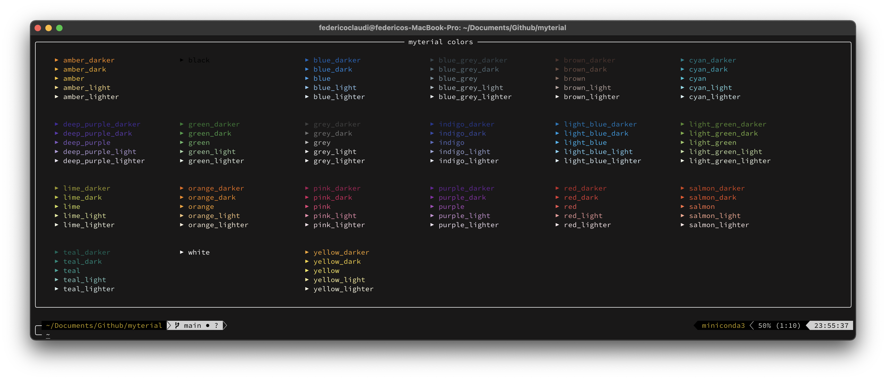
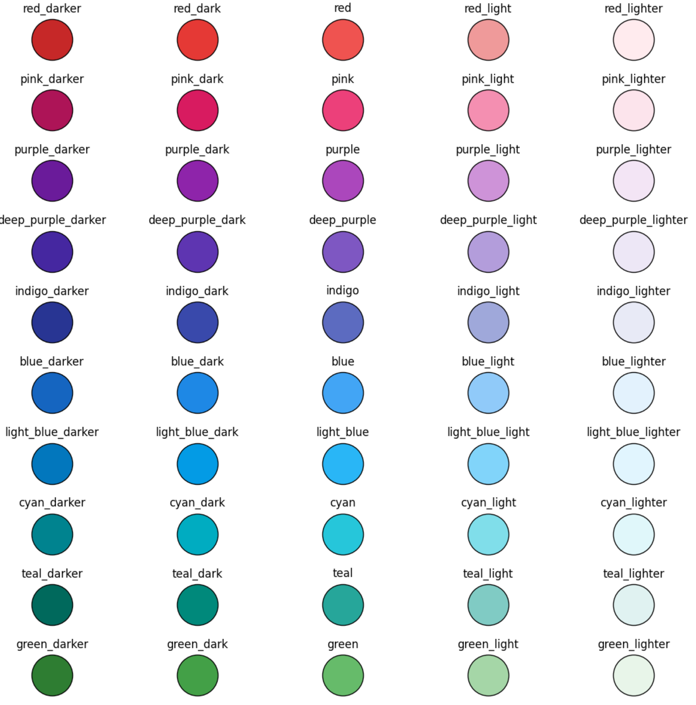

# myterial
Just an easy way to access material colors' hex codes

### Installation
```
pip install myterial
```


### Usage
```python
from myterial import salmon
```

To see all colors run `show_colors.py`

</img>


### Colors:
</img>
